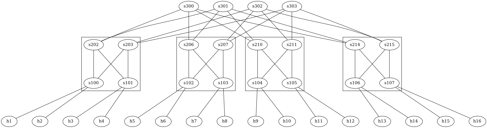

### 拓扑结构构建

在`topology-generation/fattree.py`运行文件构建拓扑结构

在根目录下运行`make`等待`mininet`启动

运行`./controller.py`来配置控制平面

此时每个主机还没有通往其他主机的路由

对于主机`hn`，`n`为数字1~16

在`mininet`命令行运行`xterm hn`构建新的窗口

在对应的`hn`窗口内运行脚本`./test-scripts/probe.py   ./test-scripts/receive.py  ./test-scripts/send.py`

#### controller解读

为每个交换机安装多播逻辑，根据网络拓扑生成多播组命令

为每个交换机安装两个流表项，分别用于处理特定协议(0x42和0x06)的数据包

为每个主机和交换机之间的链路安装边缘转发规则，将目的IP地址映射到相应的输出端口

为每个交换机安装用于计算目标TOR的流表项

加载p4信息和网络拓扑结构

为每个交换机建立P4Runtime连接，将p4程序加载到交换机中

### send.py

正常package

1. `Ethernet Header`
   1. 源mac地址（src）
   2. 目标mac地址（dst）
2. `IP Header`
   1. 目标IP地址（dst）
   2. 源IP地址（src）
3. `TCP Header`
   1. 目标端口（dport）
   2. 源端口（sport）

### probe.py

主机发送探针，交换机会根据探针的信息建立/修改转发表，选择最佳的转发策略

